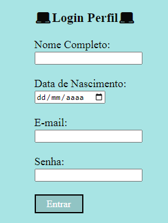
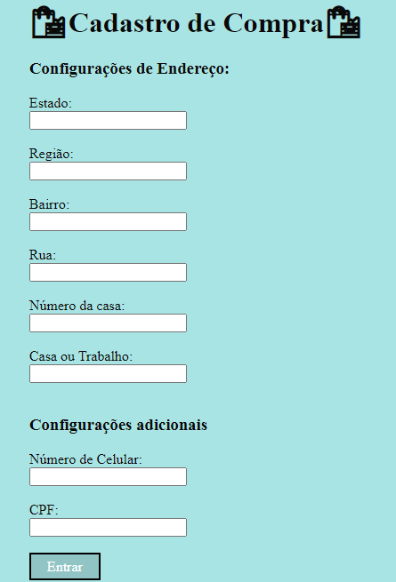
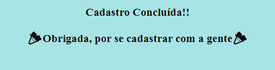
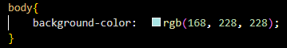
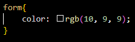
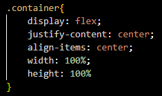
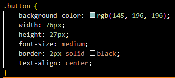
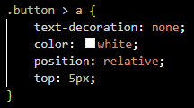
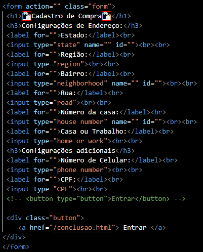

# Projeto- Form-CadEcommerce

O projeto foi criado como parte avaliativa da disciplina de Fundamentos de Desenvolvimento Web, ministrada pelo professor Leonardo Rocha.

## Índice

* [Descrição](#descrição)
* [Tecnologias](#tecnologias)
* [Referências](#referência)
* [Autor(a)](#autora)

### Descrição 

O projeto se consiste, basicamente, em três telas:

 * __Primeira:__ É necessário que o usuário insira informações pessoais, como, Nome Completo, E-mail, Senha e Data de Nascimento.
 * __Segunda:__ Já no cadastro de compra, são necessárias as informações de endereço, como, Estado, Bairro, Rua, Número  de Celular, CPF, entre outros.
 * __Terceira:__ Na terceira página, após respondidos os anteriores, uma mensagem de agradecimento.

O projeto foi baseado em três outros sites e-commerce: Shoppe, Amazon e Shein.

### Resultado do Formulário - Completo

### Estilização

O projeto foi estilizado usando o CSS3. Nos arquivos CSS referidos a cada página do projeto constam conconfigurações de estilo apresentadas a seguir:

_Body_ - 
  * Background-color - O background-color é responsável por definir a cor de fundo.

_Form_ - 
  * Color - Define a cor do texto de um elemento.

_.Container_ - 
  * Display - Determina o tipo de caixa gerada para um elemento.
  * Justify-content - Alinha itens flexíveis ao longo do eixo principal da linha atual do flex container.
  * Align-items - O align-items é responsável por controlar o alinhamento de todos os itens no eixo transversal.
  * Width - Especifica a largura da área de conteúdo, área de preenchimento ou área de borda.
  * Height - O height é resposável por determinar a altura da área do conteudo do elemento.

_.Button_ -
  * Background-color - O background-color é responsável por definir a cor de fundo.
  * Width - Especifica a largura da área de conteúdo, área de preenchimento ou área de borda.
  * Height - O height é resposável por determinar a altura da área do conteudo do elemento.
  * Font-size - Indica a altura desejada.
  * Border - Propriedade para definir largura, estilo e cor da borda.
  * Text-align - O text-align é responsável por alinhar o texto dentro de um bloco.

_.Button > a_ - 
  * Text-decoration - Decorações aplicadas à fonte usada no texto de um elemento.
  * Color - Define a cor do texto de um elemento. 
  * Position - Define como um elemento é posicionado em um documento.
  * Top - Especifica até que ponto a borda da margem superior de uma caixa posicionada de forma absoluta é deslocada abaixo da borda superior do 'bloco que contém' da caixa.

### Estrutura

 * Form - O elemento form representa uma coleção de elementos associados ao formulário.
 * H1 - O elemento h1 representa um título de seção.
 * H3 - O elemento h3 representa um título de seção. 
 * Label - O label representa uma legenda para um item em uma interface de usuário.
 * Input - O elemento input representa um campo com um controle de formulário para permitir ao usuário editar os dados.
 * Br - O br produz uma quebra de linha em um texto
 * A - Se o elemento a tiver um atributo href, ele representa um hiperlink (uma âncora de hipertexto) rotulado por seu conteúdo.

## Tecnologias

* __HTML5__
* __CSS3__
* __README__
* __Git__
* __Github__

## Referência

[Alura](https://www.alura.com.br/artigos/escrever-bom-readme) - Como escrever um README incrível no seu Github 
[lohhans](https://gist.github.com/lohhans/f8da0b147550df3f96914d3797e9fb89) - Um modelo para fazer um bom README 
[Dio](https://www.dio.me/articles/personalize-o-readme-no-github) - Personalize o README no Github 
[w3schools](https://www.w3schools.com) - informação sobre diversos elementos de html e css

## Autor(a)

O projeto foi desenvolvido pela estudante Maria Luíza Farias da Silva, aluna do primeiro ano do Ensino Médio do Marista Social Irmão Acácio.